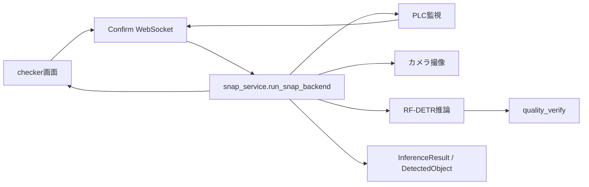

# checkerアプリケーション プログラム設計書

> 対象: `test-plc-server-bridge-to-CJ2` / `b6d2f2f`（2026-07-27確認）

## 1. システム概要

本アプリは、アクティブなプロジェクトと学習モデルを使い、カメラ画像にRF-DETR推論を行って員数条件を判定するDjangoアプリケーションです。手動画面操作とPLCトリガーは、共通の `run_snap_backend()` を使用します。

## 2. 処理構成

## 3. HTTP API

| 経路 | ハンドラー | 役割 |
|---|---|---|
| `/checker/` | `checker_index` | プロジェクト、学習モデル、ロード状態を表示 |
| `/checker/api/get_weight_path/` | `get_weight_path` | 設定名から重みパスを解決 |
| `/checker/api/set_active_project/` | `set_active_project` | アクティブプロジェクトを変更 |
| `/checker/api/set_active_training/` | `set_active_training` | アクティブ学習モデルを変更 |
| `/checker/api/load_model/` | `load_model_for_training` | バックグラウンドでモデルをロード |
| `/checker/api/check_model_status/` | `check_model_status` | モデルロード状態を返す |
| `/checker/api/reset_plc_result/` | `reset_plc_result_signals` | PLC結果信号を初期状態へ戻す |
| `/checker/api/latest_plc_result/` | `latest_plc_result` | PLC監視が保持する直近結果を返す |

`get_config_files` はコメントアウトされており、現行URLには公開されていません。

## 4. WebSocket

| 経路 | Consumer | 役割 |
|---|---|---|
| `/checker/ws/time/` | `CheckerServerTime` | 時刻およびchecker状態通知 |
| `/checker/ws/confirm/` | `Confirm` | 撮像、推論、判定、画像・JSON結果送信 |

`Confirm` 自身はPLC結果ビットを書き込みません。PLCトリガーで実行した場合、`plc_monitor.py` が結果信号を一元管理します。

## 5. 推論処理

### `run_snap_backend()`

1. `snap_lock` を非ブロッキング取得し、二重実行を拒否する。
2. カメラを初期化し、BGRフレームを取得する。
3. アクティブプロジェクトとTrainingRunを解決する。
4. 未ロードの場合は学習成果物からモデルをロードする。
5. TrainingRunの推論設定YAMLを読み込む。
6. `detect_objects()` で推論・可視化・DB保存する。
7. `quality_verify.quality_verify()` で合否を決定する。
8. PNG画像とJSON化可能な結果を `SnapResult` として返す。

### `detect_objects(img, model, project=None, training_run=None, **kwargs)`

- RF-DETRの `model.predict(image, threshold=...)` を呼び出します。
- 検出結果をクラス別に集計し、BBoxとラベルをPillowで描画します。
- `detect/YYYYMMDD/HH_MM_SS/predict/latest.png` に結果画像を保存します。
- projectとtraining_runが指定された場合、`InferenceResult` と `DetectedObject` をDBへ保存します。
- 戻り値は `(result_dict, annotated_image_array)` です。

## 6. 合否判定

現行で `snap_service.py` が使用するのは `quality_verify(result_dict)` です。

- 検出クラスが1種類だけの場合: OK
- 未検出または2種類以上の場合: NG

`quality_verify_common`、`quality_verify_book`、`quality_verify_book_pen` は差し替え用の例です。設定ファイルや管理画面からの動的切替は実装されていません。

## 7. モデル状態

- モデル本体、ロード中フラグ、ロード済みTrainingRun IDは `checker.views` のプロセス内グローバル変数です。
- モデルロードはスレッドで実行されます。
- アクティブTrainingRunとロード済みIDが異なる場合、推論を拒否します。
- 複数Djangoプロセス間ではモデル状態を共有しません。

## 8. PLC連携

PLCのアドレス、起動インターロック、結果信号、ダミー／実PLC／ブリッジモードは `zzz_docs/plc_monitor_flow.md` を参照してください。

## 9. 関連実装

- `object_detection_system/checker/views.py`
- `object_detection_system/checker/checker_consumers.py`
- `object_detection_system/checker/applications/snap_service.py`
- `object_detection_system/checker/applications/detect.py`
- `object_detection_system/checker/applications/quality_verify.py`
- `object_detection_system/checker/applications/plc_monitor.py`
- `object_detection_system/checker/applications/plc_client.py`
