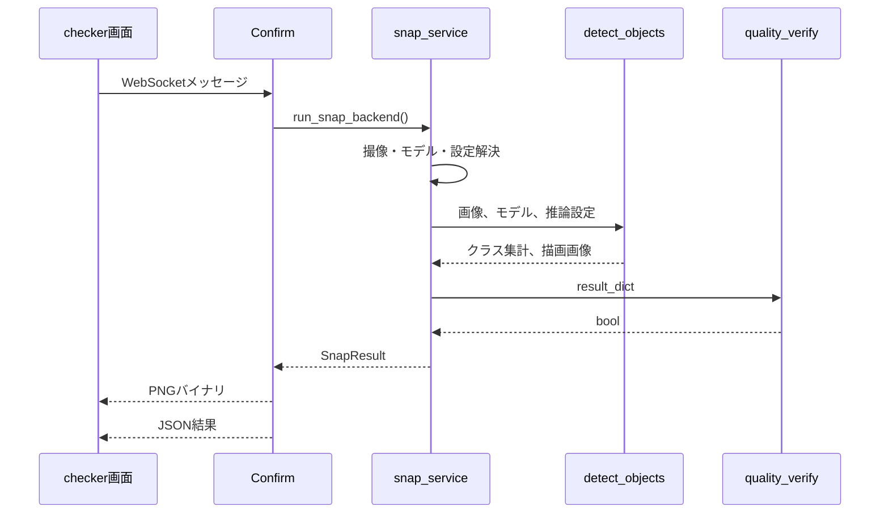
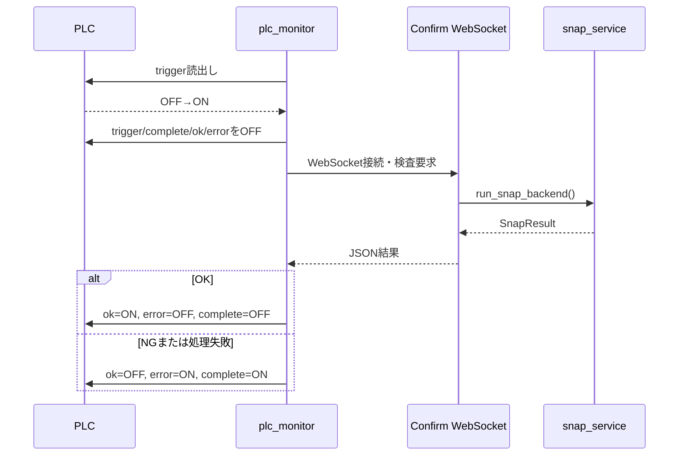

# Checkerアプリケーション詳細設計書

> 対象: `test-plc-server-bridge-to-CJ2` / `b6d2f2f`（2026-07-27確認）

## 1. 目的

学習済みRF-DETRモデルでカメラ画像を推論し、クラス別検出数に基づく合否判定を画面またはPLCへ通知します。アノテーション品質検査や汎用レポート生成を行うアプリではありません。

## 2. コンポーネント

| コンポーネント | 責務 |
|---|---|
| `views.py` | 画面、プロジェクト・モデル選択、モデルロード、PLCリセットAPI |
| `checker_consumers.py` | 時刻・状態配信、手動検査WebSocket |
| `snap_service.py` | 撮像、モデル解決、推論、判定の統合 |
| `detect.py` | RF-DETR呼出し、BBox描画、結果保存 |
| `quality_verify.py` | 検出クラス数に基づく合否判定 |
| `rfdetr_model.py` | パス再基準化とモデルロード |
| `plc_monitor.py` | トリガー監視、結果ビット、最新結果保持 |
| `plc_client.py` | FINS/UDPビットアクセス |
| `models.py` | 推論結果と検出オブジェクトの永続化 |

## 3. 手動検査シーケンス



手動検査はPLC結果ビットを書き換えません。

## 4. PLC検査シーケンス



## 5. 主要データ

### `SnapResult`

| 項目 | 型 | 意味 |
|---|---|---|
| `message` | str | 画面表示用メッセージ |
| `timestamp` | str | ISO形式の実行日時 |
| `result_dict` | dict | クラス名と検出個数 |
| `result` | bool | 合否 |
| `image_bytes` | bytes | PNG形式の結果画像 |

### `InferenceResult`

プロジェクト、TrainingRun、モデル名、結果画像パス、画像寸法、クラス集計、総検出数、推論設定、作成日時を保持します。

### `DetectedObject`

クラスID、クラス名、信頼度、正規化BBox中心座標・幅・高さを保持します。

## 6. 合否判定

`quality_verify(result_dict)` は検出されたクラスの種類数が1の場合だけTrueを返します。個数閾値による判定は現行本線では使用していません。

```python
def quality_verify(result_dict):
    return len(result_dict) == 1
```

## 7. 排他・エラー

- `snap_lock` により同一プロセス内のスナップ多重実行を拒否します。
- PLC監視はOSファイルロックで二重起動を防止します。
- カメラ、モデル、設定ファイルの不足は `RuntimeError` としてWebSocket JSONへ返します。
- モデルロード中、またはアクティブTrainingRunとロード済みIDが異なる場合は推論しません。
- PLC監視の通信失敗はerror信号と最新結果へ反映します。

## 8. 廃止・非実装事項

旧版に記載されていた次の関数・機能は現行実装にありません。

- `check_annotation_quality`
- `generate_report`
- `save_report`
- `handle_request`
- `result_detector`
- 設定ファイルやプラグインによる判定ロジックの動的切替
- 汎用的な検査レポートファイルの生成

## 9. テスト

現行テストは、RF-DETR検出変換、パス再基準化、PNG色変換、カメラフレーム、PLC結果信号、起動インターロック、立上りエッジ、Confirm API連携を検証します。実PLCと実カメラを用いる現地受入試験は別途必要です。
