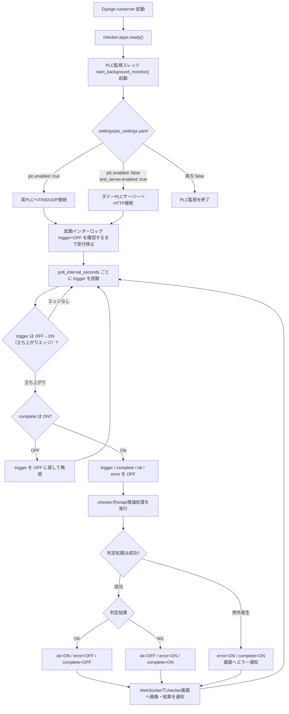
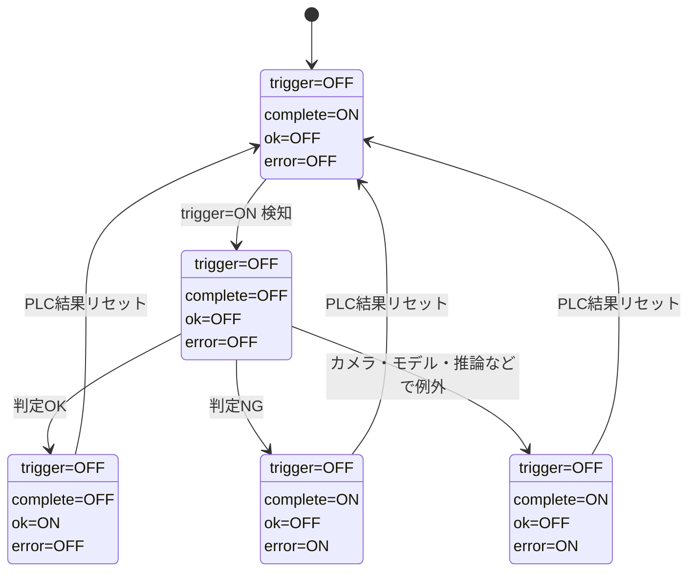

# PLC監視・ダミーPLCサーバーフロー解説

## 1. 目的

checkerアプリは、Web画面の検査開始ボタンだけでなく、PLCの監視ビットをトリガーとしてスナップショット撮影、RF-DETR推論、判定結果表示を実行できます。

PLC実機がない開発・確認環境では、FastAPI製のダミーPLCサーバーをPLCメモリの代わりとして使います。

## 2. 関連ファイル

| ファイル | 役割 |
|---|---|
| `settings/plc_settings.yaml` | PLCまたはダミーPLCサーバーの有効化、接続先、監視ビット、結果ビットを定義 |
| `plc_test_server.py` | ダミーPLCサーバー。HTTP APIと簡易Web画面でビット状態を保持・操作 |
| `object_detection_system/checker/applications/plc_monitor.py` | PLC監視本体。監視ビットをポーリングし、ON検知時にcheckerの判定処理を実行 |
| `object_detection_system/checker/apps.py` | Django runserver起動時にPLC監視スレッドを起動 |
| `object_detection_system/checker/checker_consumers.py` | WebSocketでchecker画面へPLCトリガー判定結果を通知（PLCへの書き込みは行わない） |
| `object_detection_system/checker/static/checker_index.js` | WebSocket通知を受け取り、判定画像と結果表示を更新 |

## 3. 現在の設定

`settings/plc_settings.yaml` の現在値では、実PLCではなくダミーPLCサーバーを使います。

```yaml
plc:
  enabled: false

test_server:
  enabled: true
  host: "127.0.0.1"
  port: 8010
  base_url: "http://127.0.0.1:8010"

monitor:
  area: "W"
  word_address: 100
  bit: 0
  poll_interval_seconds: 1.0
```

このため、checker側の監視処理は `W100.00` を1秒ごとにHTTPで読み取ります。

## 4. 使用するビット

| 用途 | ビット | 初期値 | 意味 |
|---|---:|---:|---|
| trigger | `W100.00` | OFF | 設備側、またはダミーPLC画面から検査開始を要求するビット |
| complete | `W200.00` | ON | 次のトリガーを受け付け可能かを示すビット |
| ok | `W200.01` | OFF | 判定OKを示すビット |
| error | `W200.02` | OFF | 判定NGまたは処理エラーを示すビット |

初期状態は `trigger=OFF`、`complete=ON`、`ok=OFF`、`error=OFF` です。

使用エリアはWエリアです。DMエリアはPLCの電源を切っても値を保持するため、電源再投入時に古いtrigger/結果ビットが残る危険があります。Wエリアは通常保持されませんが、IOM Holdを設定すると保持されるため、PLC側でIOM Holdは無効にしてください。

## 5. 全体フロー



## 6. ダミーPLCサーバーON時の挙動

ダミーPLCサーバーを起動すると、`plc_test_server.py` は設定ファイルに定義されたビットをメモリ上の辞書として保持します。

ブラウザで `http://127.0.0.1:8010/` を開くと、以下の操作ができます。

- `W100.00 Trigger ON`: `trigger=ON` にして、checkerのPLC監視に検査開始を要求する
- `Result Reset`: 初期状態へ戻す
- `All OFF`: 全ビットをOFFにする
- 個別ON/OFF: 各ビットを直接操作する

checker側の監視スレッドはダミーPLCサーバーへ以下のHTTPアクセスを行います。

| 操作 | HTTP |
|---|---|
| ビット読取 | `GET /api/bit/{area}/{word_address}/{bit}` |
| ビット書込 | `POST /api/bit` |

`trigger=ON` が検知されると、checkerは手動検査ボタンと同じバックエンド処理を実行します。処理完了後、結果画像と判定結果はWebSocket経由でchecker画面に反映されます。

## 7. ダミーPLCサーバーOFF時の挙動

ダミーPLCサーバーが停止している場合、checker側の監視スレッドはHTTP接続に失敗します。

このときの挙動は以下です。

- 監視スレッド自体は停止しない
- 接続エラーは捕捉され、最大30秒に1回だけログ出力される
- checker画面にはPLC接続エラーは通知されない
- Web画面の時計WebSocketや手動検査は、PLCサーバーとは独立して動作する
- ダミーPLCサーバーを再起動すると、次回以降のポーリングで自然に復帰する

PLC監視は常時接続ではなく、ポーリングごとのHTTPアクセスです。そのため、再接続専用の処理はありません。

## 8. 結果ビットの状態遷移



## 9. checker画面への反映

checker画面は `checker/ws/time/` のWebSocketに接続しています。このWebSocketは通常は時刻を1秒ごとに送りますが、PLCトリガー判定が完了した場合は `type: "plc_status"` のメッセージも送ります。

画面側は以下のように処理します。

- `status: "completed"`: 判定画像を描画し、OK/NG結果を表示する
- `status: "error"`: エラー表示に切り替える

つまり、PLCトリガーで実行された判定でも、最終的な画面表示は手動検査と同じ表示領域に出ます。

## 10. 二重起動防止

PLC監視には2種類の二重起動防止があります。

1. プロセス単位の二重起動防止
   - OSの一時ディレクトリに `object_detection_system_plc_monitor.lock` を作り、同時に複数のPLC監視プロセスが動かないようにします。

2. 判定処理単位の二重起動防止
   - 判定処理中はPLCポーリングを一時停止します。
   - 手動検査とPLCトリガーが同時に判定処理を走らせないよう、共通の実行状態を見ています。

## 11. 運用上の注意

- PLC結果ビットへの書き込みは `plc_monitor.py` に一本化しています。Web画面の手動検査（`snapButton`）はPLCへ書き込みません。
- アプリ起動直後は起動インターロックにより、一度 `trigger=OFF` を確認するまでトリガーを受け付けません。起動時に古い `trigger=ON` が残っていても自動実行されません。
- `trigger` はONレベルではなくOFF→ONの立ち上がりエッジで検知します。ONのまま保持しても再実行されません。
- `complete=OFF` の状態では、新しい `trigger=ON` は受け付けられません。
- 判定OK後は `complete=OFF` になるため、設備側または画面の `PLC結果リセット` で初期状態へ戻す必要があります。
- 判定NGまたは処理エラー後は `complete=ON` になるため、次のトリガーを受け付け可能です。
- ダミーPLCサーバー停止中でもcheckerアプリ全体は停止しません。ただしPLCトリガーは検知できません。
- `PLC結果リセット` ボタンもダミーPLCサーバーへHTTP書き込みを行うため、サーバー停止中は失敗します。

## 12. 実PLC通信ライブラリ（finscommand）と適用中のワークアラウンド

実PLCとのFINS/UDP通信には、PyPI公開パッケージの [finscommand](https://pypi.org/project/finscommand/)（0.1.3）を使用しています。`checker/applications/plc_monitor.py` の `PlcClient` がアダプタです。

finscommandをそのまま使わず、`PlcClient` 側で以下の3点を吸収しています。ライブラリを更新する際は、これらが解消されているかを確認してください。

### 12.1 ビットアクセスは SendCommand で自前実装

finscommandの `read` / `write` はワード単位アクセスのみで、ビット指定ができません。ワードのread-modify-writeで代用すると、同一ワード内の他ビット（例: `W200` のcomplete/ok/error）を設備側が同時に書き換えた場合に競合します。

そのため `PlcClient.read_bit` / `write_bit` は、finscommandの `SendCommand` を使ってFINSのビットアクセスコマンド（コマンドコード `01 01` / `01 02`）を直接送信しています。使用しているビットアクセス用メモリエリアコードは以下です。

| エリア | コード |
|---|---|
| CIO | 0x30 |
| W | 0x31 |
| H | 0x32 |
| A | 0x33 |
| D | 0x02 |
| E0〜 | 0x20 + バンク番号 |

### 12.2 接続先ポートの上書き

finscommandは接続先UDPポートが9600固定です（コンストラクタで指定不可）。`PlcClient.connect` で `client.addr = (host, port)` により `settings/plc_settings.yaml` の `connection.port` を反映しています。

### 12.3 `__del__` のタイポバグ回避

finscommand 0.1.3 の `fins.__del__` には `self.sock.cloase()` というタイポがあり（正しくは `close()`）、オブジェクト破棄のたびに `AttributeError` が発生します。プログラムは停止しませんが、stderrに `Exception ignored` 警告が出続け、ソケットも明示的に閉じられません。

`PlcClient.__init__` 内の `_FinsUdpClient`（finsのサブクラス）で `__del__` を正しい実装に上書きして回避しています。上流リポジトリ（https://github.com/OkitaSystemDesign/finscommand ）へのissue報告を予定しています。上流で修正された場合もこのサブクラスは同じ動作をするだけなので、残しておいて問題ありません。
