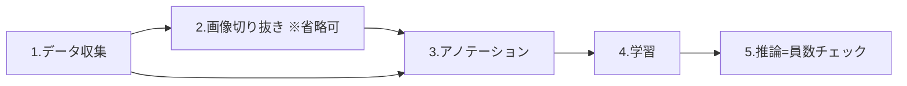

# 員数チェックシステム 運用マニュアル（生産現場作業者向け）

対象読者：生産現場の作業者（プログラミング知識は不要です）
内容：データ取得 → 画像切り抜き → アノテーション → 学習 → 推論（員数チェック）までの全手順

このシステムは、カメラで出荷箱を撮影し、AIが箱の中の部品の数を自動で数えて「OK / NG」を判定します。
AIに部品を覚えさせる準備作業（1〜5章）と、毎日の員数チェック（6章）に分かれています。

---

## 1. 全体の流れ

| 工程 | やること | 頻度 |
|---|---|---|
| データ収集 | 検査対象をカメラで撮影して画像を集める | 新製品・段取り替え時 |
| 画像切り抜き | 画像から必要な範囲だけ切り出す（省略可） | 同上 |
| アノテーション | 画像の部品に枠とラベルを付けてAIに教える | 同上 |
| 学習 | AIに部品を覚えさせる | 同上 |
| 推論（員数チェック） | 実際の検査。OK/NGを自動判定 | 毎日 |

---

## 2. システムの起動と画面の見方

1. デスクトップの「object_detection_system」アイコンをダブルクリック
2. 黒い画面が開き、続けてブラウザが自動で開きます
   - 開かない場合はブラウザで `http://127.0.0.1:8000/` を開く
3. トップページから各作業画面に移動できます。「設定・管理」→「ワークフロー管理」を開くと、工程順のガイドに沿って進められます

**終了するとき**：黒い画面で `Ctrl + C` を押すか、黒い画面を閉じます。

---

## 3. 準備作業①：プロジェクト作成とデータ収集

「プロジェクト」＝製品（検査対象）ごとのデータのまとまりです。新しい製品を検査するときは新しいプロジェクトを作ります。

### 3-1. プロジェクトの作成

1. 「データ収集」画面を開く
2. 「新規プロジェクト作成」を選ぶ（プロジェクト名は自動で日時が付きます）
3. 作成したプロジェクトが「アクティブ（作業対象）」になっていることを確認

### 3-2. 画像の撮影

1. カメラ映像が表示されることを確認
2. 実際の検査と同じ置き方で、部品を入れた箱をカメラの下に置く
3. 撮影方法は2通り
   - **自動撮影**：撮影間隔（秒）を設定してスタート。箱の中身や位置を少しずつ変えながら撮りためる
   - **手動撮影**：「スナップショット」ボタンで1枚ずつ撮影
4. 撮影のコツ
   - **50〜100枚以上**を目安に撮影する
   - 部品の位置・向き・照明を少しずつ変える（毎回同じだとAIが応用を利かせられません）
   - 実際の検査時と同じカメラ位置・明るさで撮る
5. 撮り終えたら画像を確認し、ピンボケ等の不要な画像は削除

---

## 4. 準備作業②：画像切り抜き（省略可）

画像の中に検査と関係ない部分（コンベアや背景）が大きく写っている場合、箱の部分だけを切り抜くと精度が上がります。不要なら5章へ進んでください。

1. 「画像切り抜き」画面を開き、プロジェクトを選択
2. 画像の上でマウスをドラッグして切り抜き範囲を指定
3. 「切り抜き」ボタンを押すと、**同じ範囲が全画像に適用**されて保存されます

---

## 5. 準備作業③：アノテーション（AIに部品を教える）

画像1枚1枚に「ここに部品がある」という枠（ボックス）とラベル（部品名）を付けます。この作業の丁寧さがAIの精度を決めます。

### 5-1. ラベルの登録

1. 「アノテーション」画面を開き、プロジェクトを選択
2. ラベル（部品名。例：`bolt`、`nut`）を登録する。部品の種類ごとに1つ

### 5-2. 枠付け作業

1. 画像一覧から1枚目を開く
2. 部品を1個ずつマウスのドラッグで枠で囲み、ラベルを選ぶ
3. 「保存」して次の画像へ。**全画像**に対して繰り返す

**枠付けのルール**

- 部品にぴったり合わせて囲む（余白を大きく取らない）
- 写っている部品は**すべて**囲む（囲み忘れ＝「これは部品ではない」と教えることになります）
- 一部が隠れている部品も、見えている範囲で囲む

### 5-3. データ分割

全画像のアノテーションが終わったら「**画像分割**」ボタンを押します。
学習用データと検証用データに自動で分割され、学習に必要な設定ファイル（yaml）が自動生成されます。

---

## 6. 準備作業④：学習（AIに覚えさせる）

1. 「学習」画面を開き、プロジェクトを選択
2. 学習パラメータを設定（まずは初期値でOK）

| パラメータ | 意味 | 目安 |
|---|---|---|
| epochs | 学習の繰り返し回数 | 50〜100 |
| batch_size | 一度に処理する枚数 | 4〜16（メモリ不足なら小さく） |
| resolution | 画像サイズ | 640 |
| early_stopping | 改善が止まったら自動終了 | 有効を推奨 |

3. 「学習開始」ボタンを押す
4. 進捗とloss（誤差。**下がっていけば順調**）のグラフが画面に表示されます
5. 学習には数十分〜数時間かかります。完了するとモデル（AIの頭脳ファイル）がプロジェクト内の `models` フォルダに保存されます

※ 細かい設定は「詳細設定」から可能です（`zzz_manuals/TRAINING_CONF.md` 参照）。

---

## 7. 員数チェック（毎日の検査作業）

### 7-1. 検査の準備

1. 「推論」画面を開く
2. プロジェクトと、学習済みモデル（設定ファイル・重みファイル）を選択
3. カメラ映像が表示されることを確認

### 7-2. 手動検査（画面のボタンで検査）

1. 部品を入れた箱をカメラの下に置く
2. 撮影ボタン（snapButton）を押す
3. AIが部品を検出し、種類ごとの個数を数えて **OK / NG** を画面に表示
4. 検出結果の画像（枠付き）も表示されます。結果は `detect` フォルダに日付ごとに自動保存されます

※ OK/NGの基準（どのラベルが何個でOKか）はプログラム（`quality_verify.py`）に設定されています。基準の内容・変更はメンテナーが管理します。

### 7-3. 自動検査（設備連動・PLCトリガー）

PLC連携がセットアップ済みの場合、設備のスイッチ（トリガー信号）で自動的に検査が実行されます。

1. 箱が検査位置に来ると設備がトリガーを出し、自動で撮影・判定されます
2. 判定結果は設備側（PLC）へ自動通知されます
   - **OK** → 設備が次の工程へ進む
   - **NG / エラー** → 画面で検出結果を確認し、員数を直して再検査
3. 状態がおかしいとき（検査が動かない等）は、画面右上の「**PLC結果リセット**」ボタンを押して初期状態に戻す

### 7-4. NGが出たときの確認

1. 画面の結果画像を見て、どの部品が不足/過剰かを確認
2. 実物を確認して員数を修正
3. 再度検査を実行

---

## 8. こんなときは

| 症状 | 対処 |
|---|---|
| 画面が開かない | 黒い画面が起動しているか確認。ブラウザで `http://127.0.0.1:8000/` を開き直す |
| カメラが映らない | USBの抜き差し。他のアプリ（会議アプリ等）を閉じる |
| 部品を検出しない・数え間違いが多い | カメラ位置・照明が学習時と同じか確認。改善しなければ、今の環境で撮影した画像を追加してアノテーション→再学習（3〜6章） |
| PLCトリガーで検査が始まらない | 「PLC結果リセット」を押す。改善しなければメンテナーへ連絡 |
| 学習が途中で止まる・エラー | batch_size を小さくして再実行。改善しなければメンテナーへ連絡 |
| 動作がおかしい | 黒い画面を閉じてシステムを再起動 |

**判断に迷ったら生産設備メンテナーに連絡してください。**

---

## 9. よくある質問

**Q. 新しい製品を検査したい**
A. 3章から新しいプロジェクトを作成し、撮影→アノテーション→学習を行ってください。

**Q. カメラや照明を変えた**
A. 見え方が変わるとAIの精度が落ちます。新しい環境で画像を撮り直し、再学習してください。

**Q. 判定基準（何個でOKか）を変えたい**
A. 判定基準はプログラムファイル（`quality_verify.py`）に設定されているため、変更はメンテナーに依頼してください。変更手順はセットアップマニュアル8章に記載されています。変更後は、OK品とNG品の両方で検査してみて、正しく判定されることを必ず確認してください。
